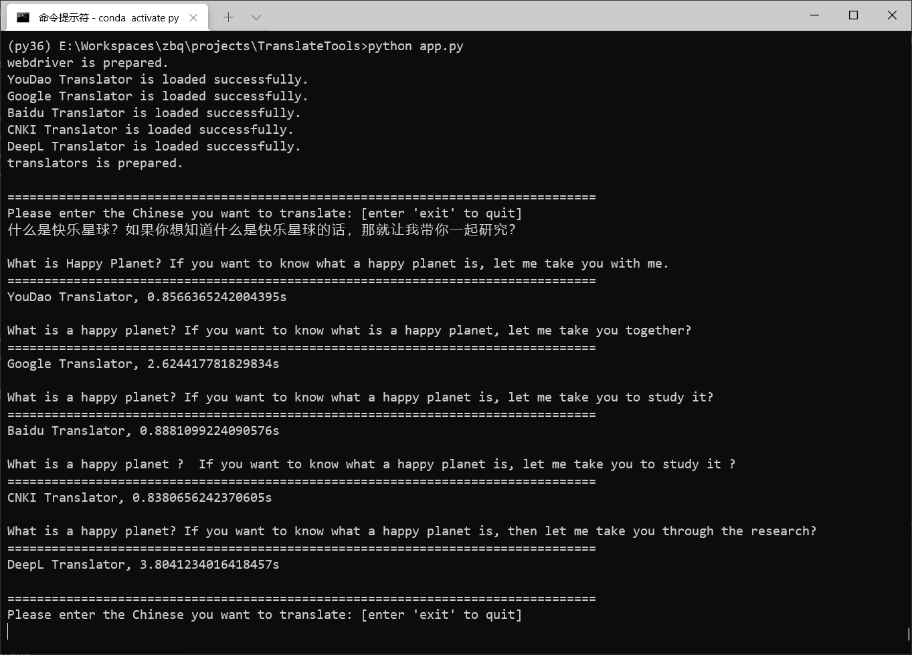

# TranslateTools

## 一个想法

最近准备将中文论文翻译成英文，想对比多个翻译网站翻译结果，但一个一个网站输入太累了，因此，想一次将中文输入到多个翻译网站，一次得到多个翻译结果，然后比对选择。

【update】突然，发现有个app做了这件事情，[多译](https://duoyiapp.com/)，不过免费使用次数有限。

## 实现方式

通过[selenium](https://github.com/SeleniumHQ/Selenium)模拟将要翻译的中文输入到多个网站，分别得到结果。

### 模拟过程

1. 切换到对应的翻译页面
2. 清空输入框
3. 输入待翻译内容
4. 获取翻译结果

## 使用方法

**主要使用Chromium版的Edge进行了测试，使用的Edge版本是91.0.864.59**

1. 下载相关python包
    ```bash
    pip install msedge-selenium-tools selenium==3.141
    ```

2. 配置WebDriver，将相应浏览器WebDriver([WebDriver下载地址合集](./drivers/README.md))下载到`./drivers`目录下，并在配置文件中配置好WebDriver的路径，见步骤3。

3. 修改配置文件`./config/config.py`
    ```json
    {
        // webdriver 配置
        "browser": {
            "name": "edge",  // 浏览器名称
            "webdriver_path": "./drivers/edgedriver_win64/msedgedriver.exe", // webdriver路径
            "headless": true, // 是否使用无头浏览器
            "without_log": true, // 是否输出log信息
            "edge_path": null, // edge可执行文件路径
            "user_agent": null // 浏览器user agent
        },
        "translators":{
            "source_language": "zh", // 待翻译语言，当前不支持修改，修改无效
            "to_language": "en", // 翻译的目标语言，当前不支持修改，修改无效
            "names": [ // 使用的翻译网站，当前只支持下面这五个，tencent、sogou会被检测出来阻止获取数据
                "youdao",
                "google",
                "baidu",
                "cnki",
                "deepl"
            ]
        }
    }
    ```
4. 运行程序
    ```bash
    python app.py
    ```
    
---

## 参考
- [microsoft - Use WebDriver (Chromium) for test automation](https://docs.microsoft.com/en-us/microsoft-edge/webdriver-chromium/?tabs=python)
- [selenium - python API文档](https://www.selenium.dev/selenium/docs/api/py/)
- [selenium - python 教程](https://www.selenium.dev/documentation/en/getting_started/)